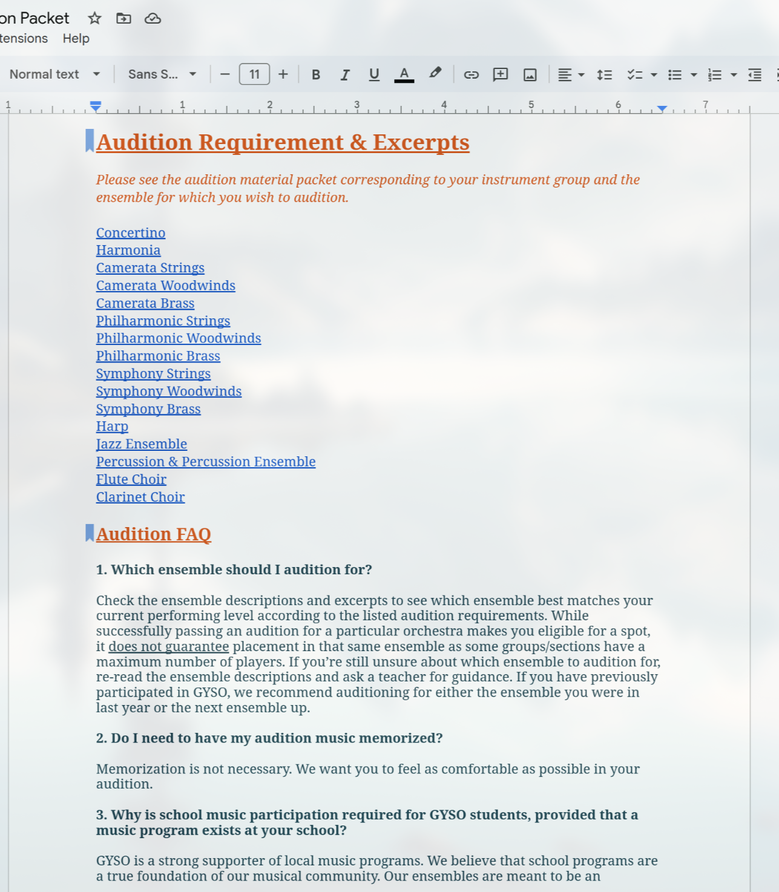
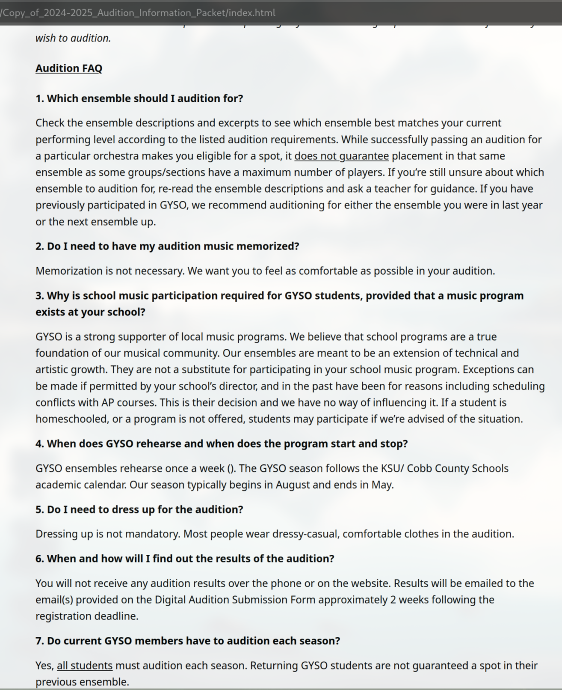

# Google Docs HTML Converter

This project provides Proof-Of-Concept (POC) tools to convert Google Docs into HTML format. 

## How to Run

```bash
# Clone the repository
$ git clone https://github.com/your-username/googledocs-html-converter.git

# Navigate to the project directory
$ cd googledocs-html-converter

# Run the converter script
$ python converter.py 
or 
$ python converter.py <google_drive_share_link> <template_file>
```

## How to Copy a Public Google Docs Link

1. Open your Google Doc.
2. Click on **Share** in the top-right corner.
3. Under **Get Link**, set the access to **Anyone with the link**.
4. Copy the link provided.

## How This Works
This tool uses predefined templates to structure the HTML output. The process involves:
1. Fetching the content of a public Google Doc.
2. Parsing the content into a structured format.
3. Applying templates to generate styled HTML.

### Template Utilization

The conversion process relies on a default template located in the `templates/default.html` directory. This template defines the structure and styling of the resulting HTML. For example, the default template includes placeholders for headers, paragraphs, and other common document elements.

You can customize the output by modifying the default template or creating a new one. The flexibility of this approach allows you to adapt the tool to various use cases, such as creating reports, presentations, or web-ready documents.

#### Example Template

Below is an example of a simple HTML template used for conversion:
<details>
<summary>HTML Template - (Click to Expand)</summary>

```html
<!DOCTYPE html>
<html lang="en">
<head>
    <meta charset="UTF-8">
    <title>{{ title }}</title>
    <style>
        body { font-family: "Segoe UI", sans-serif; padding: 2rem; line-height: 1.6; }
        h1 { font-size: 2em; color: #222; }
        h2 { font-size: 1.5em; color: #444; }
        h3 { font-size: 1.2em; color: #666; }
        p { margin: 0.8em 0; }
        strong { font-weight: bold; }
        em { font-style: italic; }
        u { text-decoration: underline; }
        ul, ol { padding-left: 2em; }
        li { margin-bottom: 0.5em; }
        .container {
                max-width: 800px;
                margin: 0 auto;
                padding: 2rem;
            }
    </style>
</head>
<body>
        <!DOCTYPE html>
<html lang="en">
<head>
    <meta charset="UTF-8">
    <title>GYSO Banner</title>
    <style>
        body {
            margin: 0;
            font-family: Arial, sans-serif;
        }

        .banner {
            display: flex;
            justify-content: space-between;
            align-items: center;
            background-color: #2c3e50;
            color: white;
            padding: 10px 20px;
            box-shadow: 0 2px 4px rgba(0,0,0,0.1);
        }

        .banner .logo {
            font-size: 1.5em;
            font-weight: bold;
        }

        .banner .nav-links {
            display: flex;
            gap: 20px;
        }

        .banner .nav-links a {
            color: white;
            text-decoration: none;
            font-weight: 500;
        }

        .banner .nav-links a:hover {
            text-decoration: underline;
        }
    </style>
</head>
<body>
        <div class="banner">
                <div class="logo">GYSO</div>
                <div class="nav-links">
                <a href="#">About</a>
                <a href="#">Auditions</a>
                <a href="#">Events</a>
                <a href="#">Contact</a>
                </div>
        </div>
        <div class="container">
            {{ content }}
        </div>
    </body>
</html>
```

</details>


This template can be found in the repository under [`templates/default.html`](templates/default.html). You can replace `{{ title }}` and `{{ content }}` with the parsed data from the Google Doc.

By editing or replacing this template, you can control the appearance and structure of the HTML output to suit your needs.

## Examples
### Google Doc to HTML Conversion

Below is an example of how a portion of an audition document from Google Docs is converted into HTML. The original Google Doc content is shown on the left, and the resulting HTML output is shown on the right.

#### Side-by-Side View

| Google Doc Content (Screenshot) | HTML Output (Screenshot) |
|----------------------------------|--------------------------|
|  |  |


## License - Provided as Proof-Of-Concept (POC)
```
MIT License

Copyright (c) 2025 05T2-GSO

Permission is hereby granted, free of charge, to any person obtaining a copy
of this software and associated documentation files (the "Software"), to deal
in the Software without restriction, including without limitation the rights
to use, copy, modify, merge, publish, distribute, sublicense, and/or sell
copies of the Software, and to permit persons to whom the Software is
furnished to do so, subject to the following conditions:

The above copyright notice and this permission notice shall be included in all
copies or substantial portions of the Software.

THE SOFTWARE IS PROVIDED "AS IS", WITHOUT WARRANTY OF ANY KIND, EXPRESS OR
IMPLIED, INCLUDING BUT NOT LIMITED TO THE WARRANTIES OF MERCHANTABILITY,
FITNESS FOR A PARTICULAR PURPOSE AND NONINFRINGEMENT. IN NO EVENT SHALL THE
AUTHORS OR COPYRIGHT HOLDERS BE LIABLE FOR ANY CLAIM, DAMAGES OR OTHER
LIABILITY, WHETHER IN AN ACTION OF CONTRACT, TORT OR OTHERWISE, ARISING FROM,
OUT OF OR IN CONNECTION WITH THE SOFTWARE OR THE USE OR OTHER DEALINGS IN THE
SOFTWARE.
```
